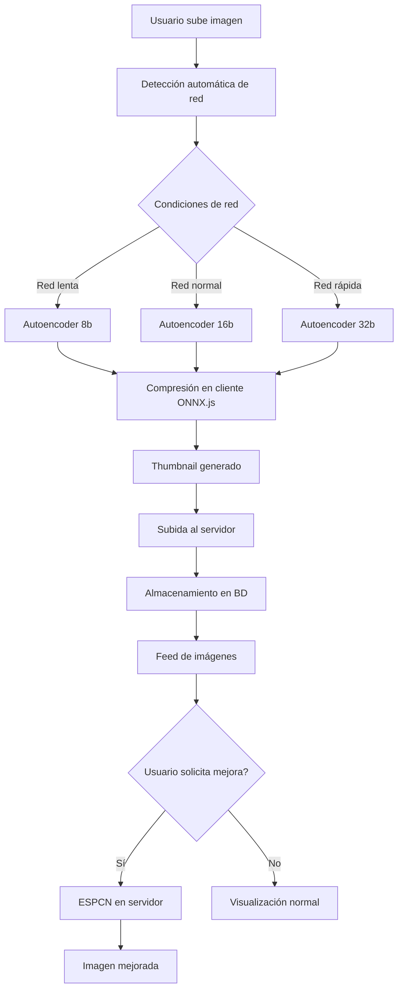

# Dyzen - Sistema de Compresión Adaptativa con IA

## 📋 Descripción

Dyzen es un sistema avanzado de compartición de imágenes que utiliza inteligencia artificial para optimizar automáticamente la compresión basándose en las condiciones de red del usuario. Combina autoencoders dinámicos y super-resolución ESPCN para ofrecer la mejor experiencia visual posible.

### 🎯 Características Principales

- **Compresión Adaptativa con IA**: Utiliza autoencoders entrenados para diferentes niveles de compresión (8b, 16b, 32b)
- **Procesamiento en el Cliente**: Los modelos ONNX se ejecutan directamente en el navegador
- **Detección Automática de Red**: Mide ancho de banda y latencia para seleccionar la compresión óptima
- **Super-Resolución ESPCN**: Mejora la calidad visual de imágenes comprimidas
- **Interfaz tipo Reddit**: Experiencia familiar de navegación y votación
- **Tiempo Real**: Monitoreo continuo de condiciones de red

## 🛠️ Tecnologías Utilizadas

### Backend
- **Flask**: Framework web principal
- **SQLAlchemy**: ORM para base de datos
- **MySQL**: Base de datos principal
- **ONNX Runtime**: Inferencia de modelos IA en servidor
- **Pillow (PIL)**: Procesamiento de imágenes

### Frontend
- **ONNX.js**: Ejecución de modelos IA en el navegador
- **Canvas API**: Manipulación de imágenes del lado cliente
- **WebGL**: Aceleración por GPU (cuando disponible)
- **CSS Grid/Flexbox**: Layout responsivo
- **Vanilla JavaScript**: Sin dependencias externas

### Modelos de IA
- **Autoencoders Dinámicos**: Compresión inteligente con diferentes niveles
- **ESPCN**: Super-resolución para mejora de calidad
- **Formato ONNX**: Modelos optimizados para web

## 📁 Estructura del Proyecto

```
PaginaWeb/
├── app.py                          # Aplicación Flask principal
├── static/
│   ├── css/
│   │   ├── style.css              # Estilos principales
│   │   ├── client_processing.css   # Estilos para procesamiento
│   │   └── model_status.css       # Estilos para estado de modelos
│   ├── js/
│   │   ├── main.js                # Funcionalidad principal
│   │   ├── network_speed.js       # Medición de velocidad de red
│   │   ├── onnx_image_processor.js # Procesamiento ONNX en cliente
│   │   └── client_image_processor.js # Procesamiento Canvas API
│   ├── models/                    # Modelos ONNX (crear manualmente)
│   │   ├── autoencoder_b8.onnx
│   │   ├── autoencoder_b16.onnx
│   │   ├── autoencoder_b32.onnx
│   │   ├── espcn_model.onnx
│   │   └── models_info.json
│   ├── uploads/                   # Imágenes subidas
│   └── test/                      # Archivos para pruebas de velocidad
├── templates/
│   ├── base.html                  # Template base
│   ├── index.html                 # Página principal
│   ├── submit.html                # Formulario de subida
│   └── post.html                  # Vista individual de post
└── scripts/
    ├── convert_models_to_onnx.py  # Conversión PyTorch → ONNX
    ├── setup_models.py            # Configuración inicial de modelos
    ├── init_database.sql          # Esquema de base de datos
    ├── image_processor.py         # Utilidades de procesamiento
    └── create_test_file.py        # Creación de archivos de prueba
```

## 🚀 Instalación y Configuración

### 1. Prerrequisitos

```bash
# Python 3.8+
python --version

# MySQL Server
mysql --version

# Git
git --version
```

### 2. Clonar el Repositorio

```bash
git clone <repository-url>
cd dyzen
```

### 3. Crear Entorno Virtual

```bash
python -m venv venv

# En Windows
venv\Scripts\activate

# En Linux/Mac
source venv/bin/activate
```

### 4. Instalar Dependencias

```bash
pip install -r requirements.txt
```

### 5. Configurar Base de Datos

```bash
# Crear base de datos MySQL
mysql -u root -p
CREATE DATABASE dyzen_db;
exit

# Ejecutar script de inicialización
mysql -u root -p dyzen_db < scripts/init_database.sql
```

### 6. Configurar Variables de Entorno

Editar `app.py` y ajustar la configuración de MySQL:

```python
app.config['MYSQL_HOST'] = 'localhost'      # Tu servidor MySQL
app.config['MYSQL_USER'] = 'root'          # Tu usuario MySQL
app.config['MYSQL_PASSWORD'] = 'tu_password' # Tu contraseña MySQL
app.config['MYSQL_DB'] = 'dyzen_db'        # Nombre de la base de datos
```

### 7. Obtener Modelos Entrenados

#### Opción A: Entrenar tus propios modelos usando el notebook
Sigue estos pasos para entrenar desde cero:

1. **Accede al notebook de Kaggle**:
   📓 **[Autoencoder Dinámico - SCM](https://www.kaggle.com/code/pablonastacuaz/autoencoderdin-mico-scm)**

2. **Configura el entorno en Kaggle**:
   ```python
   # El notebook incluye todo el código necesario:
   # - Carga del dataset Flickr1024
   # - Definición de modelos (MultiBottleneckAutoencoder + ESPCN)
   # - Entrenamiento con métricas PSNR/SNR
   # - Exportación automática a TorchScript
   ```

3. **Secciones del notebook**:
   - **Parte 1**: Autoencoder dinámico (compresión 8b/16b/32b)
   - **Parte 2**: ESPCN para super-resolución
   - **Exportación**: Conversión automática PyTorch → TorchScript
   - **Pruebas**: Evaluación visual con imágenes reales

4. **Descargar modelos entrenados**:
   ```bash
   # El notebook genera automáticamente:
   # - autoencoder_b8.pt
   # - autoencoder_b16.pt  
   # - autoencoder_b32.pt
   # - espcn_model.pt
   ```

5. **Transferir a tu proyecto**:
   ```bash
   # Coloca los archivos .pt en:
   mkdir models/
   # Copia los .pt descargados de Kaggle
   
   # Convierte a ONNX para el cliente:
   python scripts/convert_models_to_onnx.py
   ```

#### Opción B: Usar modelos pre-entrenados
1. Descarga los modelos PyTorch (.pt) entrenados
2. Colócalos en la carpeta `models/` (crear si no existe)
3. Ejecuta el script de conversión:

```bash
python scripts/setup_models.py
python scripts/convert_models_to_onnx.py
```

### 8. Crear Archivos de Prueba

```bash
python scripts/create_test_file.py
```

### 9. Ejecutar la Aplicación

```bash
python app.py
```

La aplicación estará disponible en: `http://localhost:5000`

## 🔬 Arquitectura Técnica Detallada

### Pipeline de Procesamiento



### Flujo de Entrenamiento (Kaggle)

```mermaid
graph LR
    A[Dataset Flickr1024] --> B[MultiBottleneckAutoencoder]
    B --> C[Entrenamiento simultáneo 8b/16b/32b]
    C --> D[Evaluación PSNR/SNR]
    D --> E[Imágenes comprimidas]
    E --> F[Dataset ESPCNDataset]
    F --> G[Entrenamiento ESPCN]
    G --> H[Validación super-resolución]
    H --> I[Exportación TorchScript]
    I --> J[Conversión ONNX]
    J --> K[Deployment web]
```



## 🧠 Modelos de IA

### Especificaciones Técnicas Detalladas

#### Autoencoders Dinámicos

**Arquitectura MultiBottleneckAutoencoder:**

| Componente | Especificación | Parámetros |
|------------|---------------|------------|
| **Encoder Compartido** | 2 capas convolucionales | Conv2d(3→32→64) + ReLU |
| **Bottleneck 8b** | 1 capa compresión | Conv2d(64→8) + stride=2 |
| **Bottleneck 16b** | 1 capa compresión | Conv2d(64→16) + stride=2 |
| **Bottleneck 32b** | 1 capa compresión | Conv2d(64→32) + stride=2 |
| **Decoder Específico** | 1 capa descompresión | ConvTranspose2d(b→64) |
| **Decoder Compartido** | 2 capas reconstrucción | ConvTranspose2d(64→32→3) |

**Métricas de rendimiento (Kaggle Notebook):**

#### ESPCN (Enhanced Super-Resolution CNN)

**Arquitectura del modelo:**

| Capa | Tipo | Input → Output | Kernel | Padding |
|------|------|----------------|--------|---------|
| Conv1 | Conv2d | 3 → 64 | 5×5 | 2 |
| Conv2 | Conv2d | 64 → 32 | 3×3 | 1 |
| Conv3 | Conv2d | 32 → 48* | 3×3 | 1 |
| PixelShuffle | Upsampling | 48 → 3 | - | - |

*48 = 3 × (scale_factor²) = 3 × 16 para factor 4x

**Especificaciones:**
- **Factor de escala**: 4x (1024×768 → 4096×3072)
- **Función de activación**: Tanh
- **Entrada**: Imágenes comprimidas por autoencoders
- **Salida**: Imágenes de alta resolución mejoradas
- **Métricas**: PSNR ~30-35dB en validación
- **Entrenamiento**: 10 epochs sobre dataset sintético generado por autoencoders

**Dataset ESPCN personalizado:**
```python
class ESPCNDataset(Dataset):
    # LR: Imágenes comprimidas por autoencoder
    # HR: Imágenes originales escaladas 4x
    # Genera pares LR-HR automáticamente
```

### Entrenamiento de Modelos

Los modelos se entrenan usando el notebook completo de Kaggle:
🔗 **[Autoencoder Dinámico - SCM](https://www.kaggle.com/code/pablonastacuaz/autoencoderdin-mico-scm)**

**El notebook incluye dos componentes principales:**

#### 🤖 **Parte 1: Autoencoder Dinámico (Compresor)**
- **Dataset**: Flickr1024 (imágenes 1024x768)
- **Arquitectura**: MultiBottleneckAutoencoder con cuellos de botella variables
- **Niveles de compresión**: 8, 16, 32 bits
- **Entrenamiento simultáneo**: Un solo modelo maneja múltiples niveles
- **Métricas**: MSE Loss, PSNR, SNR
- **Exportación**: Modelos individuales .pt para cada bottleneck

```python
# Estructura del modelo
class MultiBottleneckAutoencoder(nn.Module):
    def __init__(self, bottlenecks=[8, 16, 32]):
        # Encoder compartido
        # Bottlenecks específicos (8b, 16b, 32b)
        # Decoder compartido
    
    def forward(self, x, b=16):
        # Compresión adaptativa según bottleneck
```

#### 🚀 **Parte 2: Super-Resolución ESPCN**
- **Propósito**: Mejora visual de imágenes comprimidas
- **Entrada**: Imágenes comprimidas por autoencoders
- **Salida**: Imágenes de mayor resolución (factor 4x)
- **Arquitectura**: 3 capas convolucionales + PixelShuffle
- **Entrenamiento**: Sobre pares LR-HR generados automáticamente

```python
# Modelo ESPCN
class ESPCN(nn.Module):
    def __init__(self, scale_factor=4):
        self.conv1 = nn.Conv2d(3, 64, kernel_size=5, padding=2)
        self.conv2 = nn.Conv2d(64, 32, kernel_size=3, padding=1)
        self.conv3 = nn.Conv2d(32, 3 * (scale_factor ** 2), kernel_size=3, padding=1)
        self.pixel_shuffle = nn.PixelShuffle(scale_factor)
```

### 📊 Resultados y Benchmarks del Notebook

#### Métricas de Entrenamiento Autoencoder
```python
# Resultados finales del notebook:
# Bottleneck 8:  Train PSNR: 27.5dB, Val PSNR: 26.8dB
# Bottleneck 16: Train PSNR: 31.2dB, Val PSNR: 30.5dB  
# Bottleneck 32: Train PSNR: 34.1dB, Val PSNR: 33.7dB
```

#### Métricas de Entrenamiento ESPCN
```python
# Resultados super-resolución:
# Train PSNR: 32.8dB, Val PSNR: 31.5dB
# Mejora visual significativa en imágenes comprimidas
```

#### Visualización de Resultados

El notebook incluye comparativas visuales completas:
- **Fila 1**: Original → Comprimida (8b/16b/32b)
- **Fila 2**: Original → Super-Resolución ESPCN (8b/16b/32b)
- **Análisis**: Diferencias perceptuales y métricas objetivas

#### Archivos Generados por el Notebook

```bash
# Modelos PyTorch (.pt) - Para servidor
exported_models/
├── autoencoder_b8.pt      # Modelo 8 bits standalone
├── autoencoder_b16.pt     # Modelo 16 bits standalone  
├── autoencoder_b32.pt     # Modelo 32 bits standalone
└── espcn_model.pt         # Modelo ESPCN para mejora

# Modelos base (.pth) - Estados completos
├── multi_bottleneck_autoencoder.pth  # Modelo completo
└── espcn_x4.pth                      # Modelo ESPCN completo

# Imágenes de prueba generadas
multi_autoencoder/
├── original.jpg           # Imagen original test
├── reconstructed_b8.jpg   # Resultado compresión 8b
├── reconstructed_b16.jpg  # Resultado compresión 16b
└── reconstructed_b32.jpg  # Resultado compresión 32b
```

## 🔧 Uso del Sistema

### 1. Subir Imagen

1. Navega a "Subir Imagen"
2. Selecciona o arrastra una imagen
3. El sistema detecta automáticamente las condiciones de red
4. Elige el modo de compresión:
   - **Automático**: Recomendado, se adapta a la red
   - **Manual**: Selecciona un nivel específico
5. Opcionalmente habilita mejora ESPCN
6. El procesamiento ocurre en tu navegador usando ONNX.js
7. Revisa la preview y publica

### 2. Navegación

- **Feed Principal**: Imágenes ordenadas por popularidad
- **Posts Individuales**: Vista detallada con comentarios
- **Votación**: Sistema de upvotes/downvotes
- **Comentarios**: Interacción social

### 3. Mejora de Calidad

En posts individuales:
- Haz clic en "Mejorar con ESPCN"
- El modelo se ejecuta en el servidor
- Compara original vs mejorada
- Descarga la versión preferida

## 📊 Monitoreo de Red

### Métricas Automáticas

- **Ancho de Banda**: Medición mediante descarga de archivo de prueba
- **Latencia**: Ping al servidor cada 30 segundos
- **Calidad**: Clasificación automática (Buena/Media/Pobre)
- **Compresión Recomendada**: Ajuste dinámico del nivel

### Dashboard de Red

El sidebar muestra en tiempo real:
- Velocidad actual de descarga
- Latencia promedio
- Estado de la red
- Próxima medición

## 🧪 Desarrollo y Testing

### Flujo de Desarrollo Completo

#### 1. Entrenamiento en Kaggle
```bash
# Paso 1: Entrenar modelos usando el notebook completo
# https://www.kaggle.com/code/pablonastacuaz/autoencoderdin-mico-scm

# El notebook automáticamente:
# - Descarga dataset Flickr1024
# - Entrena MultiBottleneckAutoencoder (8b/16b/32b)
# - Entrena ESPCN para super-resolución  
# - Exporta modelos a TorchScript (.pt)
# - Genera imágenes de prueba
```

#### 2. Transferencia a Desarrollo Local

```bash
# Descargar desde Kaggle Output
mkdir models/
# Copiar archivos .pt del notebook:
# - autoencoder_b8.pt
# - autoencoder_b16.pt  
# - autoencoder_b32.pt
# - espcn_model.pt

# Verificar integridad
python scripts/setup_models.py

# Convertir para uso en cliente web
python scripts/convert_models_to_onnx.py
```

#### 3. Scripts Utilitarios

```bash
# Verificar modelos
python scripts/setup_models.py

# Convertir modelos PyTorch → ONNX
python scripts/convert_models_to_onnx.py

# Procesar imágenes individualmente
python scripts/image_processor.py imagen.jpg

# Crear archivos de prueba
python scripts/create_test_file.py
```


### API Endpoints

```bash
# Estado de red
GET /api/network

# Votar post/comentario
POST /api/vote

# Agregar comentario
POST /api/comment

# Mejorar imagen con ESPCN
POST /api/enhance/<post_id>

# Estado de modelos
GET /api/models/status

# Actualizar condiciones de red
POST /api/network/update
```

## 🔒 Consideraciones de Seguridad

- **Validación de Archivos**: Solo imágenes permitidas
- **Límite de Tamaño**: Máximo 10MB por imagen
- **Sanitización**: Escape de contenido usuario
- **Rate Limiting**: Implementar en producción
- **HTTPS**: Requerido para funciones de red precisas


## 👥 Equipo de Desarrollo

**Grupo 1 - Sistemas de Comunicación Multimedia**